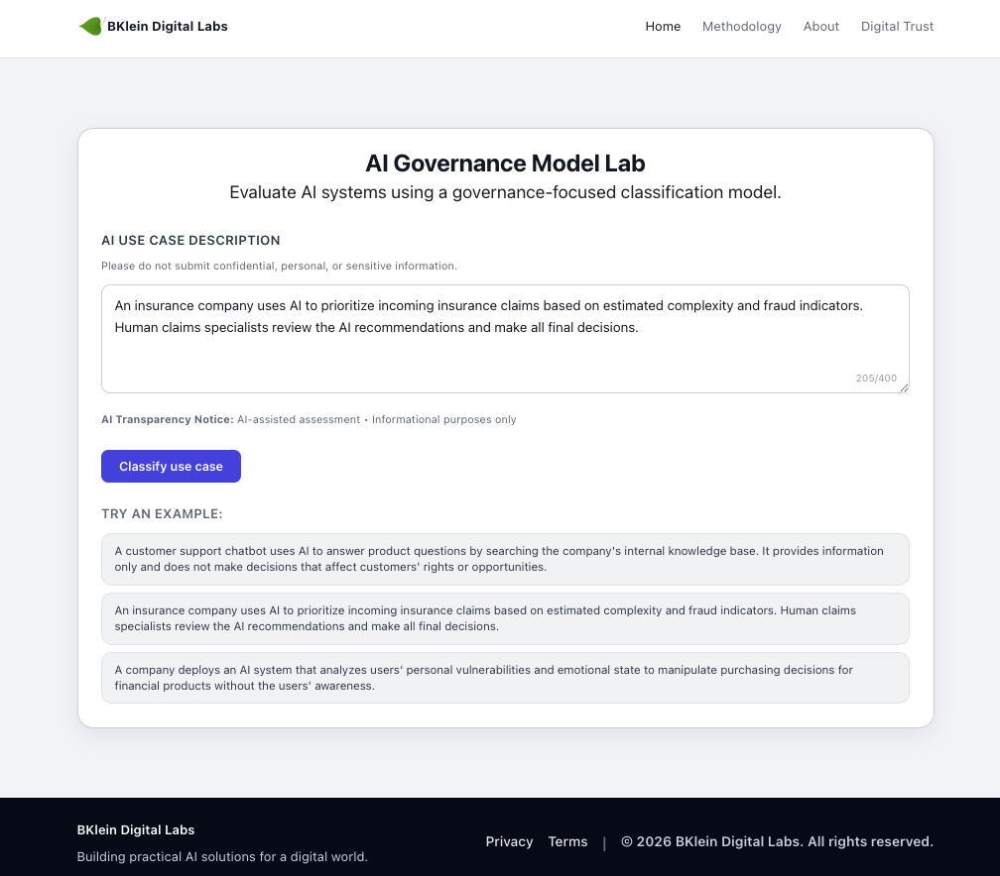
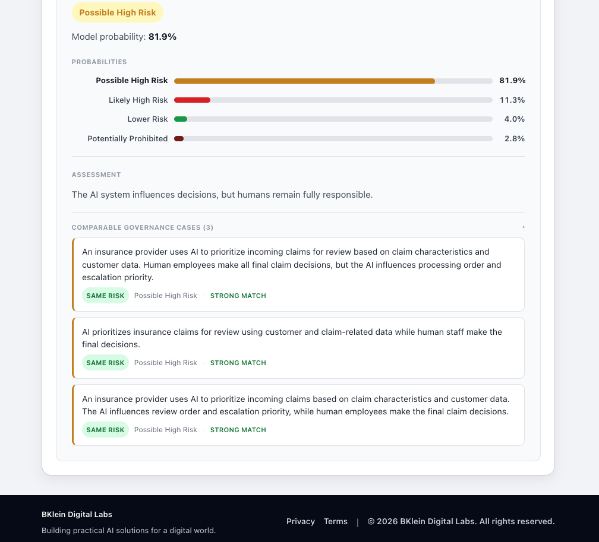
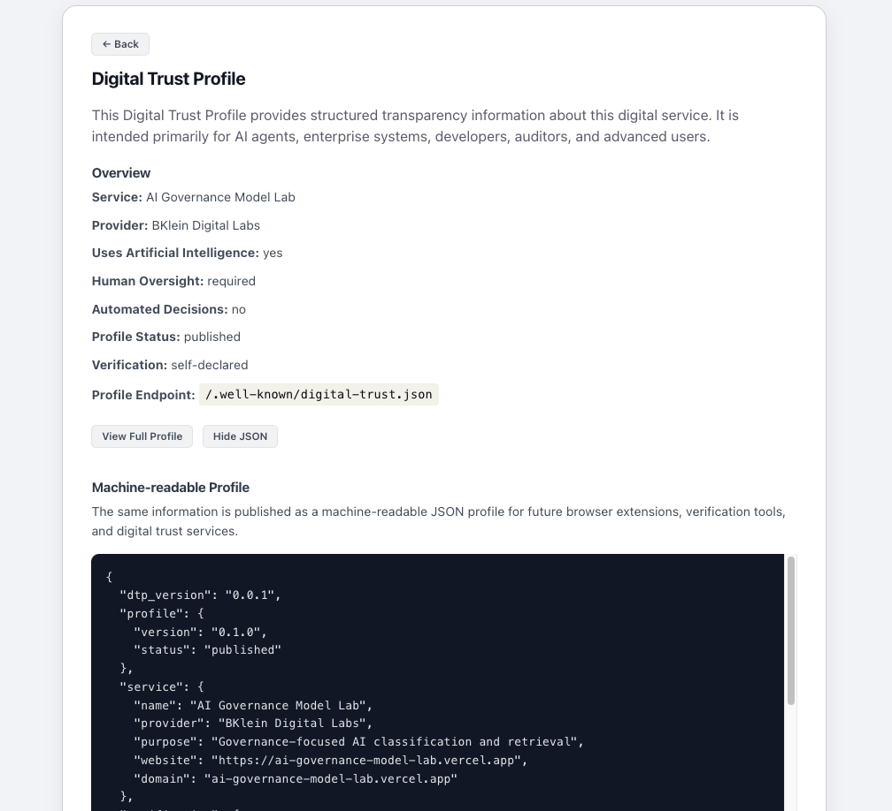
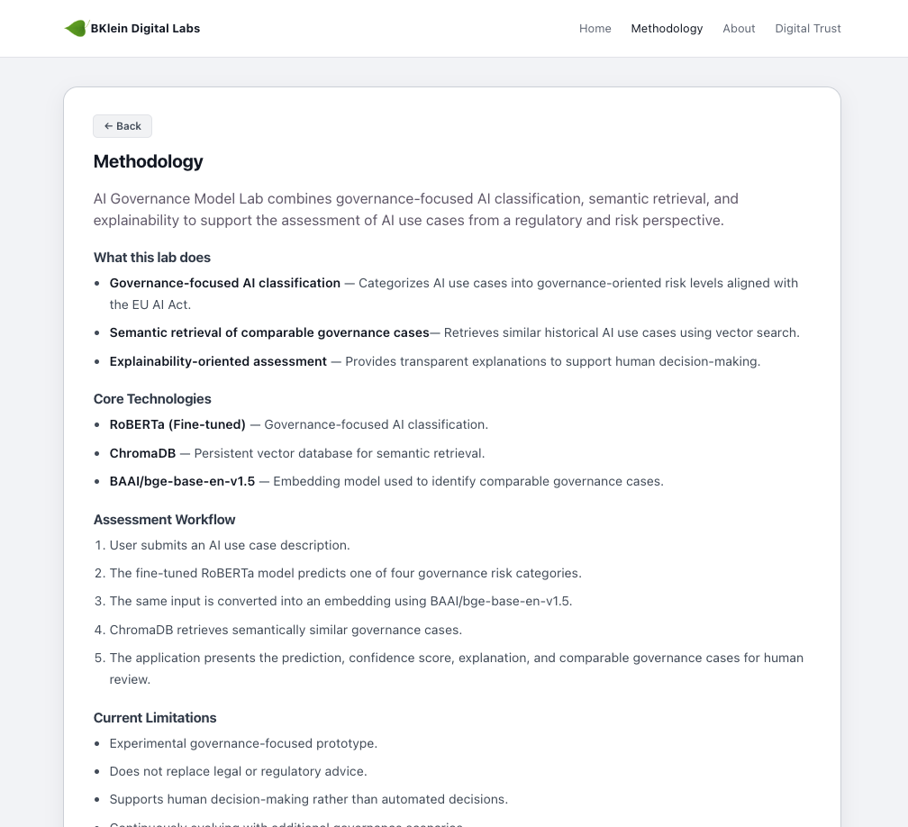

# AI Governance Model Lab

Organizations are increasingly adopting AI systems while facing growing governance and regulatory expectations. AI Governance Model Lab is a practical assessment platform that helps organizations evaluate AI use cases by combining governance-oriented classification with semantic retrieval of comparable governance scenarios.

AI Governance Model Lab is a governance-focused AI assessment platform designed to classify AI use cases according to potential governance and regulatory risk patterns.
The platform combines:
- Fine-tuned AI governance classification
- Semantic retrieval of comparable governance cases
- Explainability-oriented assessment logic
- Governance-focused UI and assessment workflow

The project is designed as a practical governance support tool for SMEs, consultants, governance teams, and organizations exploring AI adoption.

# Governance-Focused Classification

The application evaluates AI use cases and classifies them into governance-oriented categories:
- Lower Risk
- Possible High Risk
- Likely High Risk
- Potentially Prohibited

The classification logic is based on a fine-tuned RoBERTa model trained on governance-oriented AI use cases.

# Comparable Governance Cases

The platform retrieves semantically related governance examples using ChromaDB vector retrieval and BAAI embeddings.

This helps users:
- compare similar governance scenarios
- understand governance boundaries
- improve assessment explainability

## Live Demo

Frontend:
https://ai-governance-model-lab.vercel.app

Backend API:
https://ai-governance-model-lab.onrender.com/docs


## Screenshots

### Home



### Assessment Results



### Digital Trust Profile



### Methodology



---

# Architecture

## Frontend

* React + Vite + CSS
* Hosted on Vercel

## Backend

* FastAPI
* Python
* Hosted on Render

## AI Components

### Classification

* Fine-tuned RoBERTa model
* Hosted via Hugging Face

### Retrieval

* Hugging Face Transformers
* Sentence Transformers
* ChromaDB vector database
* Similar case retrieval: BAAI/bge-base-en-v1.5 embeddings

---

## Features

### AI Capabilities
- Fine-tuned RoBERTa classification
- Semantic retrieval
- Confidence scoring
- Comparable governance cases

### Platform
- FastAPI backend
- React + Vite frontend
- REST API
- Render + Vercel deployment

### Engineering
- Custom dataset
- ChromaDB
- Hugging Face integration
- End-to-end deployment pipeline

## Digital Trust

The project includes a Digital Trust Profile that publishes structured transparency information about the service in both human-readable and machine-readable formats.

- Digital Trust Profile
- Machine-readable JSON (`/.well-known/digital-trust.json`)
- AI Transparency Notice
- Privacy and Governance information

This implementation also serves as the first reference implementation of the proposed Digital Trust Profile draft standard.

---

## Practical deployment challenges

The deployment process also involved solving practical engineering challenges such as:
- Cloud memory limitations,
- Model loading and hosting,
- API routing,
- CORS configuration,
- Vector database initialization,
- Frontend/Backend integration.


# Example Workflow

1. User enters AI use case description.
2. Frontend sends request to FastAPI backend.
3. RoBERTa model predicts governance risk priority.
4. ChromaDB retrieves semantically similar cases.
5. Results are displayed in the frontend.

---

### Example 1
Input:
"We use AI to summarize internal meeting notes."

Output:
Lower Risk
Confidence: 94.4%

### Example 2
Input:
"A system ranks insurance claims for staff review."

Output:
Possible High Risk
Confidence: 91.3%

### Example 3
Input:
"An AI system automatically rejects job applicants."

Output:
Likely High Risk
Confidence: 96.2%

### Example 4
Input:
"A company uses AI to manipulate vulnerable users into buying financial products."

Output:
Potentially Prohibited
Confidence: 93.5%

---

# Local Development

## Backend

```bash
pip install -r requirements.txt
uvicorn src.api:app --reload
```

## Frontend

```bash
npm install
npm run dev
```

## Architecture Diagram

Frontend (Vercel)

        ↓
FastAPI Backend (Render)

        ↓
RoBERTa Model (HF Hub)

        ↓
ChromaDB Semantic Retrieval

        ↓
Comparable Gevernance Cases

---

# Environment Variables

## Frontend

```env
VITE_API_URL=https://ai-governance-model-lab.onrender.com
```

# Privacy & Data Minimization

The platform is designed with privacy and data minimization principles in mind.

Users should not submit:
- confidential company information
- personal data
- proprietary information
- internal identifiers

Future governance telemetry and feedback features are planned with anonymization and GDPR-oriented design considerations.

---

# Future Improvements

## Platform
* Multi-language support
* PDF reports

## AI
* Governance feedback
* Additional datasets
* Explainability


# Known Limitations

This platform:
- provides governance-oriented guidance
- is not legal advice
- is not a formal EU AI Act conformity assessment
- may produce uncertain or boundary classifications
- should be used as governance support tooling

---

## License

Licensed under the Apache License, Version 2.0.
See the LICENSE file for details.

## Author

BKlein Digital Labs

Building practical AI solutions for a digital world.